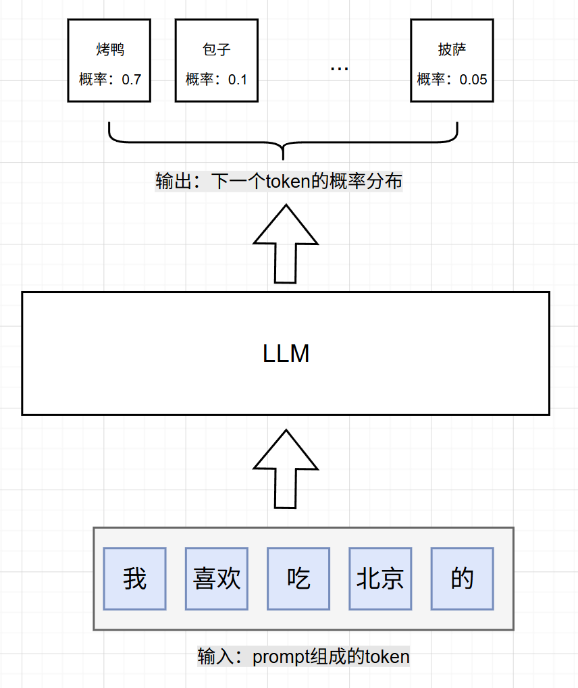
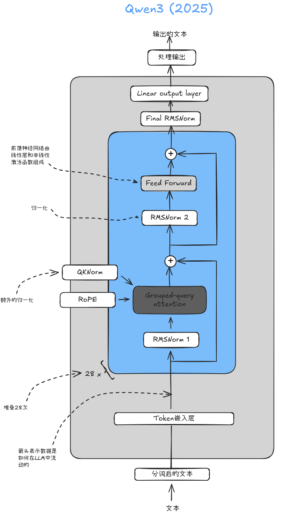
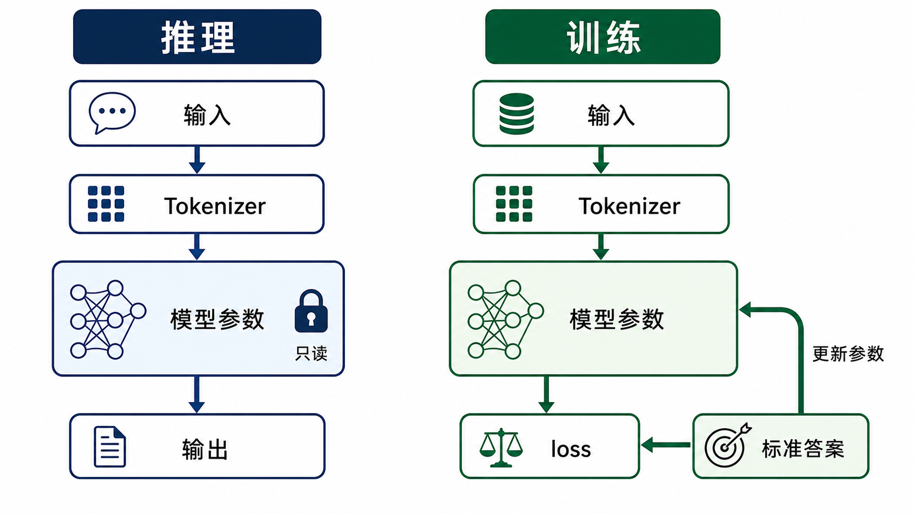
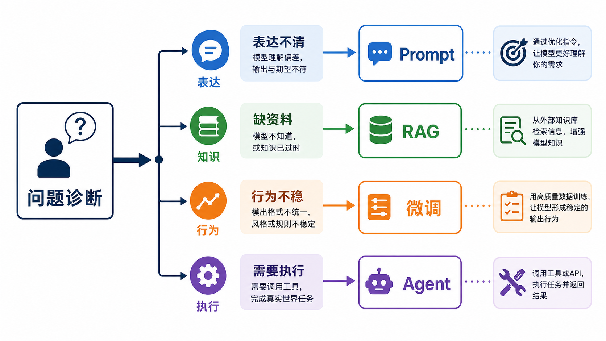
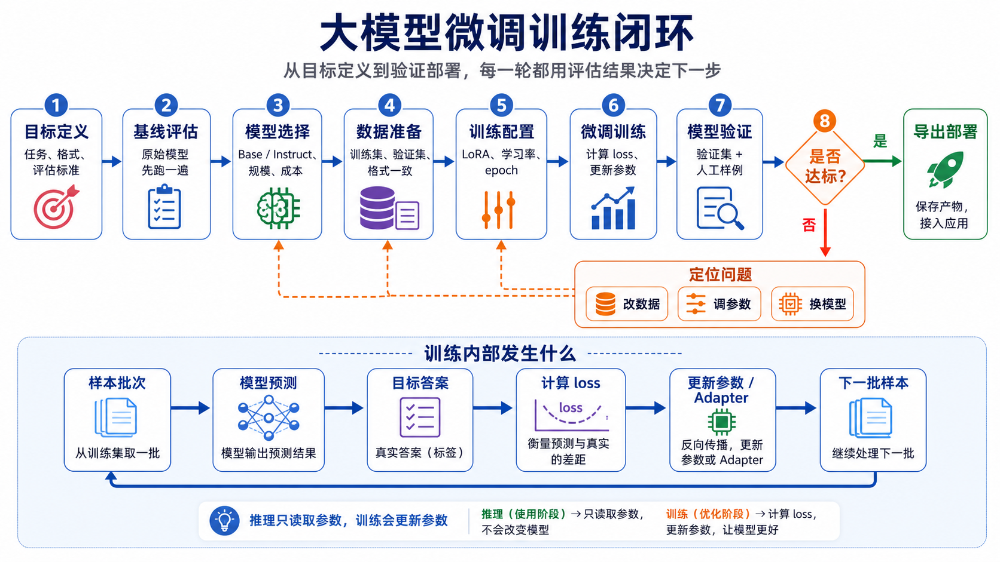
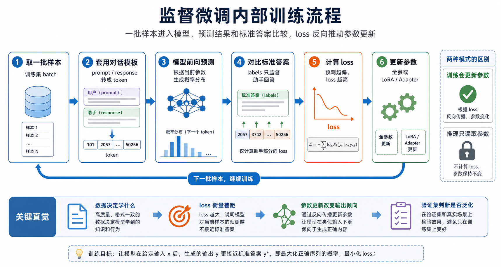

# 28 - 大模型微调概述与训练闭环

---

**本章课程目标：**

- 理解微调在大模型应用开发中的位置：它解决的不是“资料查询”，而是“让模型在固定任务上更稳定地按规则输出”。
- 用工程语言解释微调到底改了什么：token、参数、loss（损失值）、训练和推理之间是什么关系。
- 分清 Prompt 工程、RAG、微调、Agent / Workflow 的边界，避免一遇到效果不好就急着训练模型。
- 掌握一次监督微调项目的完整闭环：模型选择、数据准备、微调训练、模型验证、迭代调整。
- 建立后续章节的学习地图，知道第 29-32 章分别会继续讲数据、方法、LLaMA-Factory 实操和 vLLM 部署。

**学习建议：** 你已经在 [1-3 RAG、微调、续训与智能体选型](1-3-RAG、微调、续训与智能体选型.md) 中见过微调的基础定位。本章不再重复做一遍完整选型课，而是把视角切到“如果真的要做一次微调项目，应该怎样理解它、拆解它、验证它”。第一遍阅读时，先抓住一条线：**微调不是把知识塞进模型，而是用样本改变模型的输出倾向；项目成败不看训练是否跑起来，而看验证是否证明它真的更可用。**

**官方文档与资源**：详见 [工具导航与参考资料索引 - 微调与模型对齐](工具导航与参考资料索引.md#微调与模型对齐)。

---

## 1、这一章先解决什么问题

微调听起来像一件很“底层”的事：要下载模型、准备数据、配置训练参数、观察 loss、导出权重、部署服务。很多初学者第一次接触时，会直接跳到工具界面或命令行，先把训练跑起来再说。

这样做容易有一个问题：训练虽然启动了，但你不知道自己到底在证明什么。

比如：

- 训练 loss 下降了，真实业务输入却没有变好；
- 模型能复现训练集里的答案，换一种问法就不稳定；
- 知识库问答效果不好，却误以为只要微调就能解决；
- 输出格式偶尔出错，但其实 Prompt 还没有写清楚；
- 小模型效果差，不知道是数据问题、模型能力问题，还是训练参数问题。

所以本章先不急着讲“点哪个按钮”。我们先把微调放回项目里看清楚：

1. 大模型为什么能被微调？
2. 微调到底改的是模型的哪一部分？
3. 哪些问题值得微调，哪些问题不该优先微调？
4. 一次微调项目应该怎样从模型选择走到验证闭环？

第 29-32 章会继续展开具体环节。本章要做的，是先给你一张清楚的地图。

---

## 2、微调到底改了什么

### 2.1 大模型是在不断预测下一个 token

大语言模型生成文本时，并不是一次性写出完整答案。它更像是在反复做同一件事：

> 根据前面的上下文，预测下一个 token。

token 可以理解为模型处理文本时使用的最小片段。它可能是一个字、一个词，也可能是词的一部分。tokenizer（分词器）负责把自然语言切成 token，再把 token 转成模型能处理的数字编号。

一轮生成大致是这样：

1. 用户输入 prompt。
2. tokenizer 把文本切成 token。
3. 模型根据当前上下文计算下一个 token 的概率分布。
4. 系统按采样策略选出一个 token。
5. 新 token 拼回上下文，再继续预测下一个 token。
6. 直到生成结束符、达到最大长度，或被系统中断。

下面这张图先帮你建立直觉：模型是在已有上下文后面一步步接出答案。



这件事和微调有什么关系？

这里先补一个概念约定：**微调是一个大概念，监督微调 SFT 是其中最常见、也最适合入门的一类。** 本系列第 28-32 章主要围绕 SFT 展开；后文如果没有特别说明，“微调”基本都可以先按“监督微调”理解。

监督微调并不是让模型背一张问答表，而是在大量样本中反复告诉模型：**在这种输入后面，更应该接近这种目标输出。** 如果训练数据长期保持同一种输出格式、标签体系或语气风格，模型在类似输入下就会更倾向于生成这种模式。

### 2.2 参数记录的是模型的生成倾向

一个典型大语言模型可以粗略分成三部分：

- 输入层：把 token 转成向量。
- Transformer Block 堆叠层：让 token 之间建立上下文关系。
- 输出层：把最后的向量映射到词表维度，得到下一个 token 的概率分布。

下图会出现一些具体结构名，比如 RMSNorm、RoPE、注意力层等。这里不用逐个记住，先抓住主线就行：文本先变成 token 和向量，经过多层模型计算，最后再变成下一个 token 的概率分布。



模型里的大量矩阵数值，就是参数。我们说一个模型是 0.6B、7B、14B、32B，指的就是参数规模大约有多少。

参数不是一份资料库，也不是一张数据库表。它们更像模型在训练过程中形成的生成倾向。严格说，参数就是一组浮点数；方便理解时，可以把它看成模型对语言结构、任务模式、表达风格和知识关联形成的压缩经验。

微调做的事情，就是在已有参数基础上继续训练，让模型在某类输入下更倾向于生成我们希望的输出。

### 2.3 微调不是把资料写进模型

这可能是最容易搞混的地方。

如果你把企业制度、产品手册、接口文档拿去微调，模型并不会因此在内部多出一个可以检索、更新、引用来源的知识库。训练结束后，我们保存的是新的模型权重、LoRA adapter（LoRA 适配器）或合并后的模型参数，而不是一套可查询资料。

adapter 可以理解为挂在基座模型旁边的一小组可训练参数。它能改变模型在特定任务上的表现，但它仍然不是资料库。

所以要先分清两类需求：

| 需求                                     | 更适合的方案     | 原因                           |
| ---------------------------------------- | ---------------- | ------------------------------ |
| 让模型知道最新制度、产品手册、企业资料   | RAG              | 知识可更新、可检索、可引用来源 |
| 让模型稳定输出固定格式、标签、语气、术语 | 微调             | 调整模型的行为倾向             |
| 让模型查库存、调接口、写入系统           | Agent / Workflow | 需要流程编排和工具调用         |
| 只是想让模型按要求写得更清楚             | Prompt 工程      | 成本最低，迭代最快             |

一句话记住：**RAG 主要补知识，微调主要改行为。**

### 2.4 训练和推理的区别：参数会不会被更新

训练和推理都会把文本送进模型，但二者最大的区别是：**是否更新参数**。

**推理**时，模型只读取当前参数，根据输入生成答案，参数不会变化。你和模型多聊几轮，只是在当前上下文里继续生成，不会自动把这几轮对话写回模型。

**训练**时，模型会先根据当前参数做预测，再把预测结果和目标答案比较，得到 loss（损失值），然后根据这个差距更新参数或 adapter 参数。



这也是为什么“把几段对话发给模型看一看”不等于微调。只有把样本整理成训练数据，并进入训练流程，模型版本才可能发生变化。

---

## 3、微调在训练链路中的位置

### 3.1 预训练、监督微调和对齐

现代大语言模型通常会经历几个阶段。

| 阶段           | 常见数据                         | 主要目标                           | 得到的能力                   |
| -------------- | -------------------------------- | ---------------------------------- | ---------------------------- |
| 预训练         | 大规模无标注语料                 | 学语言结构、知识关联和基础推理模式 | 会续写，具备通用语言建模能力 |
| 监督微调 SFT   | 指令和回答、多轮对话样本         | 学会按指令完成任务                 | 从“续写文本”变成“完成任务”   |
| 对齐 Alignment | 偏好数据、安全规范、人工排序数据 | 让回答更符合人类偏好和安全边界     | 更有帮助、更安全、更可控     |

预训练后的模型已经学到大量语言规律，但它更像一个强大的续写器。监督微调会用“输入 + 标准输出”样本教它理解任务。对齐则进一步让模型的回答更符合人类偏好、安全规范和产品边界。

也因此，本系列第 28-32 章会把 SFT 作为主线：先看数据怎样整理成“输入 + 标准输出”，再看训练方法、LLaMA-Factory 实操和部署调用。

### 3.2 为什么本系列先讲 SFT

SFT 适合作为入门主线，原因很简单：

- 它是业务微调最常见的起点；
- 它和数据格式、训练参数、模型验证之间的关系最清楚；
- LLaMA-Factory 对 SFT 支持成熟，适合教学和跟做；
- 对齐方法需要偏好数据和更复杂评估，适合在掌握 SFT 后继续深入。

可以把 SFT 理解成：**用高质量示例教模型按你的方式完成任务。**

这不是从零训练一个基础大模型，也不是重新做一次大厂级预训练，而是在已有模型能力上做有针对性的适配。

### 3.3 Base Model 与 Instruct Model

做 SFT 前要先选底座模型。最常见的区分是 Base Model 和 Instruct Model。

**Base Model** 是预训练后的基础模型。它通常擅长续写，但不一定天然会像聊天助手一样回答问题。你给它一个问题，它可能继续补全文本，而不是按“用户提问、助手回答”的方式组织答案。

**Instruct Model** 是在 Base Model 基础上经过指令微调的模型，有些还经过对齐。它更懂用户在请求什么，也更适合客服问答、内容生成、结构化输出、多轮对话等应用任务。

对大多数应用开发者来说，默认优先选择 Instruct Model。Base Model 不是不能用，而是更适合高度定制、数据量足够、团队知道自己要从更基础状态开始塑形的场景。

本课程后续实操会优先使用 Instruct Model。这样学习重点会落在数据、训练方法、验证和部署上，而不是一开始就被底座模型的指令能力问题拖住。

---

## 4、什么时候值得微调

### 4.1 先复盘四类问题

第 1-3 章已经完整讲过 Prompt、RAG、微调、Agent 的选型。这里不再重复展开，只做一个开训前复盘。

当一个 AI 应用效果不好时，先问四个问题：

| 诊断问题                 | 常见现象                                        | 优先考虑                |
| ------------------------ | ----------------------------------------------- | ----------------------- |
| 任务是不是没说清楚？     | 输出格式没约束、示例太少、指令有歧义            | Prompt 工程             |
| 模型是不是没看到资料？   | 不知道企业制度、产品手册、最新公告              | RAG                     |
| 模型是不是行为不稳定？   | 标签飘、JSON 经常错、话术不统一、术语译法不固定 | Prompt 优化，必要时微调 |
| 任务是不是需要执行动作？ | 查库存、调接口、写订单、审批、重试              | Workflow / Agent        |



这张图是为了提醒你：训练模型是成本更高的一步。能用 Prompt 解决的，先别急着微调；缺资料的问题，先把 RAG 做好；需要调用工具的问题，不要指望微调替代业务流程。

### 4.2 微调更适合“长期稳定的行为”

微调更有价值的场景，通常有几个共同特点：

- 任务长期稳定，不是每天换规则；
- 输出形式明确，例如标签、JSON、关键词、固定话术；
- 有足够高质量样本，且样本格式一致；
- 能用验证集或测试样例判断效果；
- Prompt 已经尝试过，但小模型仍然不稳，或者成本/延迟要求让你不能一直调用更大的模型。

比如：

- 从商品评论中抽取 3-8 个关键词，并固定用英文分号分隔；
- 把客服回复稳定在某种品牌语气；
- 从用户问题中识别固定意图标签；
- 把内部专有名词翻译成统一译法；
- 让本地小模型稳定输出某种 JSON 结构。

这些问题的共同点不是“缺一份资料”，而是模型需要形成稳定的输出习惯。

### 4.3 小模型更容易体现微调价值

如果你使用的是很强的云端大模型，很多格式和风格问题通过 Prompt 就能解决。模型越强，指令遵循能力越好，微调的收益就越需要谨慎评估。

但在成本、隐私、离线部署、低延迟等场景里，你可能会使用更小的模型。小模型参数少，对复杂 Prompt 的理解和执行更容易漂。这时微调就有机会把固定任务模式灌进去，让小模型在某个窄任务上表现得更像一个专用模型。

所以比较稳的顺序是：

1. 先用 Prompt 建立清晰任务边界。
2. 如果缺资料，优先补 RAG。
3. 如果目标任务固定、数据可靠、输出仍然不稳，再评估微调。
4. 如果涉及外部动作，设计 Workflow 或 Agent。

---

## 5、一次微调项目的训练闭环

### 5.1 四步不是流水线，而是循环

一次监督微调项目可以拆成四个环节：1. 模型选择；2. 数据准备；3. 微调训练；4. 模型验证。

下图强调的是“闭环”。微调不是点一次训练按钮就结束，而是通过验证结果不断回到前面调整。



真实项目里，经常会出现这些情况：

- 训练 loss 下降，但验证集不降，可能是过拟合；
- 输出格式稳了，但回答变啰嗦，可能是数据风格不一致；
- 验证样例不错，上线样例不稳，可能是测试覆盖太窄；
- 小模型怎么调都不够，可能是底座能力不足；
- 目标任务变好，但通用能力下降，可能训练过度或数据太窄。

所以微调项目不能只问“训练跑起来了吗”，更要问“验证是否证明它值得被部署”。

### 5.2 第一步：模型选择

模型选择先看四件事。

**第一，看模型类型。** 多数应用任务优先选择 Instruct Model。它已经具备基本指令遵循能力，后续微调只需要在目标任务上进一步收窄行为。

**第二，看参数规模。** 参数越大，通常能力越强，但训练和推理成本也越高。入门时建议从成本可控的中小模型开始验证，再根据效果升级。

| 任务类型                | 初始规模参考                      | 说明                       |
| ----------------------- | --------------------------------- | -------------------------- |
| 意图识别、文本分类      | 1B-7B                             | 任务边界清楚，输出短       |
| FAQ、普通客服、工单辅助 | 7B-14B                            | 需要一定语言理解和稳定表达 |
| 企业知识库问答 / RAG    | 7B-14B 起步，复杂场景 14B-32B     | 通常要和 RAG 配合          |
| NL2SQL                  | 简单场景 7B-14B，复杂场景 14B-32B | 强依赖结构理解和准确性     |
| 本地轻量部署            | 0.5B-4B                           | 更看重成本、速度和设备限制 |

这些数字只是起点，不是标准答案。最终要看验证集、人工样例、延迟、显存、预算和业务容错率。

**第三，看生态支持。** 许可证是否允许使用，tokenizer 是否完整，chat template（对话模板）是否匹配，LLaMA-Factory、Transformers、PEFT、vLLM 等工具是否支持，这些都会影响后续训练和部署。

**第四，看硬件成本。** 训练不是只把模型权重放进显存，还要考虑梯度、优化器状态、激活值、上下文长度、batch size 等额外开销。第 30 章会专门讲全参数微调、LoRA、QLoRA 和显存直觉。

### 5.3 第二步：数据准备

数据准备决定微调上限。

一个合格样本至少要满足三点：

- 输入接近真实场景；
- 输出就是你希望模型长期学习的标准答案；
- 同类样本的格式、语气、标签和规则保持一致。

比如你要训练关键词抽取，却在数据里混用这些输出：

```text
AI; 微调; 数据集
关键词：AI、微调、数据集
["AI", "微调", "数据集"]
AI / 微调 / 数据集
```

模型学到的就会是混乱模式。后续输出漂移，不能只怪训练参数，因为数据本身就在传递冲突规则。

第 29 章会重点讲数据：公共数据、私有数据、指令式格式、对话式格式、OpenAI messages、ShareGPT、chat template，以及本课程提供的 `keywords_data_train.jsonl` 示例数据。

### 5.4 第三步：微调训练

训练阶段是实际更新参数的环节。

简化理解如下：

1. 训练程序取一批样本；
2. 按模板把样本转换成模型输入；
3. 模型根据当前参数预测输出 token；
4. 系统把预测结果和标准答案比较，得到 loss；
5. 根据 loss 更新参数或 adapter 参数；
6. 换下一批样本继续循环。

下面这张图只看训练内部：一批样本先经过对话模板和 tokenizer 变成模型输入，模型根据当前参数做前向预测，再用 labels（标准答案）计算 loss，最后通过反向传播更新参数或 LoRA / Adapter。这个过程会一批接一批重复，直到完成本轮训练。



图里出现的训练细节，第 31 章会结合 LLaMA-Factory 的训练日志、loss 曲线和保存产物继续展开。

第一次看训练日志时，会反复见到这些词：

| 术语          | 入门理解                           | 在本系列哪里展开 |
| ------------- | ---------------------------------- | ---------------- |
| 训练集        | 参与训练，用来更新参数的数据       | 第 29、31 章     |
| 验证集        | 不参与训练，用来观察泛化能力的数据 | 第 29、31 章     |
| loss          | 模型预测和标准答案之间的差距       | 第 31 章         |
| epoch         | 完整遍历训练集一轮                 | 第 31 章         |
| batch size    | 每次送入模型的一批样本数           | 第 30、31 章     |
| step          | 参数更新次数                       | 第 31 章         |
| cutoff length | 单条样本最大 token 长度            | 第 29、31 章     |
| 过拟合        | 训练集变好，新数据变差             | 第 30、31 章     |
| 灾难性遗忘    | 新任务变好，原本能力下降           | 第 30、31 章     |

本章只需要先知道这些词在闭环里的位置。参数怎么选、显存怎么估、LoRA 和 QLoRA 为什么省资源，后面会专门拆开讲。

### 5.5 第四步：模型验证

模型验证要回答一个问题：

> 微调后的模型，是否在未见过的数据和真实业务输入上更可用？

只看训练 loss 不够。至少要看三类证据：

| 证据         | 看什么                       | 作用                     |
| ------------ | ---------------------------- | ------------------------ |
| 训练 loss    | 训练数据上是否越来越接近答案 | 判断训练是否在学习训练集 |
| 验证 loss    | 未参与训练的数据上是否也变好 | 判断泛化趋势             |
| 人工样例测试 | 真实输入下输出是否符合预期   | 判断业务可用性           |

如果训练 loss 下降，但验证 loss 不降甚至上升，常见原因是过拟合。模型越来越熟悉训练集，却没有学到可泛化规则。

如果验证 loss 看起来不错，但人工测试发现格式仍不稳定，可能是验证集没有覆盖关键场景，或者你的指标和业务目标不一致。

如果目标任务变好了，但普通问答、代码能力、推理能力明显下降，就要警惕灾难性遗忘。尤其是数据量少、风格窄、训练轮数多、学习率过高时，更容易发生。

---

## 6、开训前的检查清单

在真正开始训练前，建议先过一遍下面三组检查。它们能帮你避免“训练跑完了，却不知道该怎么判断”的尴尬。

### 6.1 需求是否适合微调

| 检查项                  | 说明                                   |
| ----------------------- | -------------------------------------- |
| 目标任务是否固定        | 微调适合长期稳定任务，不适合每天换规则 |
| 输出形式是否明确        | 标签、JSON、关键词、固定话术越明确越好 |
| 是否只是缺知识          | 缺知识优先 RAG                         |
| Prompt 是否已经充分尝试 | Prompt 还没写清楚时，先别急着训练      |
| 是否有评估标准          | 没有评估标准，就无法判断训练是否成功   |

### 6.2 数据是否能支撑微调

| 检查项           | 说明                       |
| ---------------- | -------------------------- |
| 样本是否真实     | 要接近线上实际输入         |
| 输出是否一致     | 同类任务避免混用多种格式   |
| 标注是否可靠     | 错答案会直接教坏模型       |
| 是否覆盖边界场景 | 不能只覆盖最简单样例       |
| 是否处理敏感信息 | 训练前要处理隐私和安全边界 |

### 6.3 工程是否能闭环

| 检查项             | 说明                                             |
| ------------------ | ------------------------------------------------ |
| 模型能否下载和加载 | 权重、配置、tokenizer 要完整                     |
| 工具是否支持       | LLaMA-Factory、Transformers、PEFT、vLLM 是否兼容 |
| 资源是否够         | 显卡、磁盘、内存、训练时长要可承受               |
| 产物能否保存和导出 | 训练结果要能部署和复现                           |
| 是否能回滚         | 效果不好时要能切回基线模型                       |

### 6.4 先写一张微调实验卡

正式训练前，建议为每一次实验写一张“微调实验卡”。它不需要复杂，但要让你训练后能复盘：这次到底改了什么，效果为什么变好或变差。

| 项目         | 本次记录                                          |
| ------------ | ------------------------------------------------- |
| 任务目标     | 例如：从商品评论中抽取 3-8 个关键词               |
| 目标输出格式 | 例如：只输出关键词，英文分号分隔                  |
| 底座模型     | 例如：Qwen3-0.6B-Instruct                         |
| 选择理由     | 例如：资源可承受，适合跑通教学流程                |
| 数据来源     | 例如：课程提供的 `keywords_data_train.jsonl`      |
| 训练样本数   | 例如：1000 条                                     |
| 验证样本数   | 例如：100 条                                      |
| 微调方法     | 例如：LoRA 或 QLoRA                               |
| 关键参数     | epoch、learning rate、cutoff length、LoRA rank 等 |
| 基线效果     | 微调前用同一批测试样例跑一次                      |
| 微调后效果   | 微调后再跑同一批测试样例                          |
| 失败样例     | 记录最典型的错误输出                              |
| 下一轮调整   | 改数据、改参数、换模型或放弃微调                  |

这张卡的价值，是让微调从“凭感觉调参”变成“基于证据迭代”。

一个更稳的实验顺序是：

1. 固定一批测试样例。
2. 先用原始模型跑一遍，记录基线。
3. 微调后用同样样例再跑一遍。
4. 对比格式稳定性、答案质量、错误类型。
5. 每一轮只改一个主要变量，再进入下一轮。

---

## 7、场景判断练习：这些问题该不该微调

下面用几个场景练习判断。重点不是背答案，而是看清问题属于知识、行为，还是流程。

| 场景                                                         | 优先方案                                      | 判断理由                                           |
| ------------------------------------------------------------ | --------------------------------------------- | -------------------------------------------------- |
| 员工问“年假怎么申请”“最新报销标准是多少”，系统要引用制度来源 | RAG                                           | 知识会更新，且需要可追溯来源                       |
| 客服机器人要统一品牌语气，开头、结尾、拒绝话术都要稳定       | 先 Prompt，小模型不稳再微调                   | 这是风格和输出稳定性问题                           |
| 从商品评论中抽取 3-8 个关键词，只输出英文分号分隔            | Prompt 或微调                                 | 任务固定、格式明确，适合做微调入门任务             |
| 用户询问昨天刚发布的政策，并要求基于官方文件解读             | RAG                                           | 知识新，微调更新成本高                             |
| 公司内部产品名有固定译法，希望模型不要直译                   | Prompt + 术语表；长期稳定且小模型不稳时可微调 | 取决于术语规模、更新频率和稳定性要求               |
| 用户说“查一下 A 商品库存，有货就下单”                        | Workflow / Agent                              | 需要查库存、确认价格、写订单，不是单纯输出风格问题 |

如果你仍然拿不准，可以回到三个问题：

1. 它缺的是资料，还是缺的是稳定行为？
2. 它能不能通过更清楚的 Prompt 解决？
3. 它有没有足够稳定的数据和评估标准？

只有第三个问题也能答清楚，微调才比较值得启动。

---

**章节思考题：**

1. 为什么说微调不是“把资料塞进模型”？

   **参考思路：** 微调调整的是模型参数或 adapter 参数，让模型在类似输入下更倾向于生成某种输出；它不会在模型内部生成一个可检索、可更新、可引用来源的资料库。企业制度、产品手册、最新政策这类知识更新问题，通常优先考虑 RAG。

2. 训练和推理最核心的区别是什么？

   **参考思路：** 推理只读取当前参数，根据输入生成输出，参数不会变化；训练会把预测结果和标准答案比较，计算 loss，并根据误差更新参数或 adapter。普通聊天不会自动微调模型。

3. Base Model 和 Instruct Model 有什么区别？为什么应用场景通常优先选 Instruct Model？

   **参考思路：** Base Model 更像预训练后的续写器，不一定天然理解用户指令；Instruct Model 已经经过指令微调或对齐，更懂任务、对话和助手式回答。多数应用开发不是从零塑形模型，所以优先选 Instruct Model 更稳。

4. Prompt 工程、RAG、微调、Agent / Workflow 分别适合解决什么问题？

   **参考思路：** Prompt 工程适合把任务说清楚、约束格式和提供示例；RAG 适合补充外部知识、私有资料和最新信息；微调适合长期稳定的格式、风格、标签、术语和行为习惯；Agent / Workflow 适合多步执行和工具调用。

5. 训练 loss 下降但验证效果不好，可能有哪些原因？

   **参考思路：** 可能是过拟合、训练数据太少或太重复、验证集不代表真实场景，也可能是模型只学会训练集表面格式。判断效果时不能只看训练 loss，还要看验证 loss、人工样例和真实业务输入。

6. 开始训练前为什么要先写“微调实验卡”？

   **参考思路：** 实验卡能记录任务目标、模型、数据、参数、基线、微调后效果和失败样例。没有这些记录，就很难判断效果变化来自数据、参数、模型还是评估样例。

7. 如果企业知识库问答效果不好，你会先检查 RAG 还是先做微调？为什么？

   **参考思路：** 通常先检查 RAG。企业知识库问答多半是资料是否召回、内容是否新、引用是否准确的问题。微调可以改善表达习惯和任务行为，但不适合作为频繁更新知识的主要承载方式。

**本章小结：**

本章要带走的不是一堆训练名词，而是一条判断主线：先判断问题是缺资料、缺稳定行为，还是缺外部执行流程，再决定用 Prompt、RAG、微调或 Agent / Workflow。

大模型生成文本的基本方式，是根据上下文预测下一个 token。微调通过训练样本调整模型参数或 adapter，让模型在某些输入场景下更倾向于生成你希望的输出。它适合固定任务、稳定格式、统一风格、术语习惯和小模型能力补强，不适合承载频繁变化的知识，也不能替代业务流程。

完整微调项目包括模型选择、数据准备、微调训练和模型验证。关键不在于训练能不能跑起来，而在于验证能不能证明模型在未见过的数据和真实业务输入上更可用。

**建议下一步：** 继续阅读 [第 29 章 微调数据准备与对话模板](29-微调数据准备与对话模板.md)，先把训练数据、对话格式和 chat template 理清楚。微调项目里很多问题看起来像训练参数问题，最后往往都能追到数据和模板。
